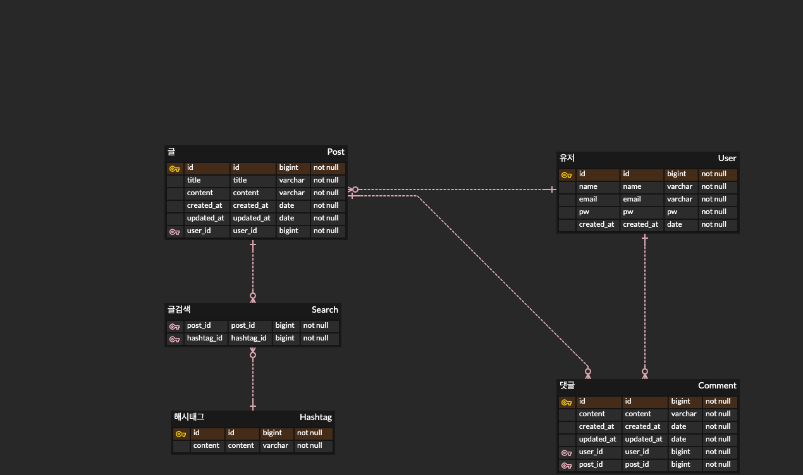
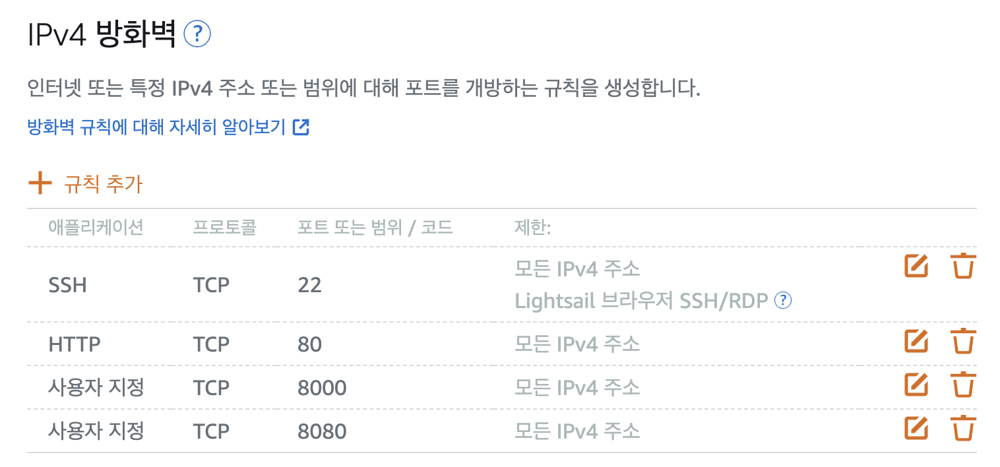
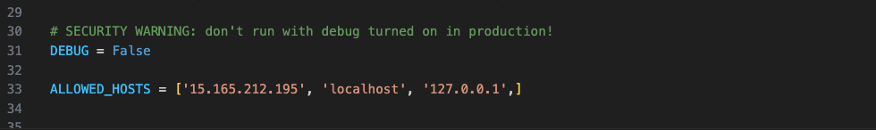

# ESTsoft-BE-bootcamp-project-2-django

## 주제: Django를 활용한 싱가포르 여행카페 만들기

### 목표
- Django로 CRUD & 인증 구현
- AWS, Uwsgi, Nginx를 활용한 Backend Server 배포

### 개발환경


- 주요 라이브러리 버전
```
- asgiref==3.7.2
- Django==4.2.3
- sqlparse==0.4.4
- typing_extensions==4.7.1
```
### 배포
  
  
  
  
### 개발기간
- 2023.07.17 ~ 2023.07.20

### 배포 URL
- http://15.165.212.195/

### ERD 기획

- 처음 기획할 당시 2단계를 목표로 구현하여 Reply에 테이블에 대한 고려가 없었습니다. 구현하다보니 reply테이블을 추가구현하였으나 ERD상에서는 반영되지 않았습니다. Reply 테이블을 Comment테이블과 비슷하나, Post를 foreinkey로 참조하지 않았습니다. 

### 기능 기획 (마인드맵)

 

### 페이지 구현
#### 메인페이지


#### 회원가입


#### 로그인 & 로그아웃


#### 게시글 목록


#### 게시글 작성


#### 게시글 상세보기 (오류: 해시태그 삭제가 안되는 문제가 발생하였으나 잡지못하고 넘어가는 한계)


#### 게시글 검색: 해시태그 테이블을 구현하여, 해시태그별로 글을 검색할수있게 기능 구현


#### 게시글 수정


#### 게시글 삭제(아래 글 삭제한 후 목록으로 리다이렉션)


#### 댓글 작성 & 삭제


#### 대댓글 작성 & 삭제


### 프로젝트를 진행하면서 어려웠던 점
1. 로컬호스트 환경에서 정상적으로 실행 그러나 배포 과정에서 오류 -> 아래와 같이 해결하였습니다.
 - AWS상에서 방화벽 TCP포트 열어주기
  
 - settings.py 상에서 Allowed Host 추가
  
- Uwsgi 및 Nginx 환경설정파일 수정에 대한 어려움 -> 블로그를 보고 해결 했으나, 제대로 이해하지 못한 한계점.
  
2. 대댓글 기능을 구현하는 과정에서, Comment 모델에 재귀적으로 구현 실패-> Reply 모델을 새로 만들어서 foreign key로 연결하는 방법으로 해결.

### 마치며
장고를 배우고, AWS 서버에 배포하는 경험을 처음 경험해보았습니다. 이 경험을 바탕으로 더욱 개발에 정진할 수 있는 동기부여가 된 프로젝트이기에 기억에 많이 남을 것 같습니다.
